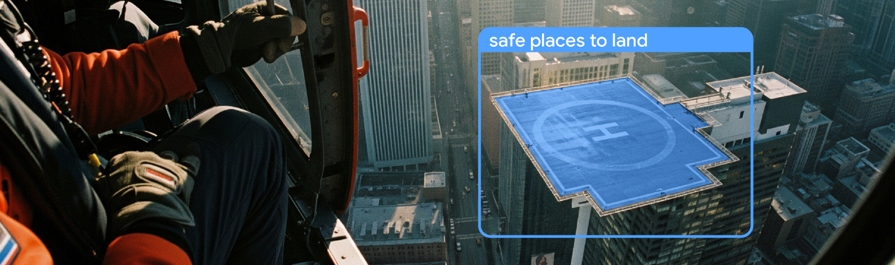
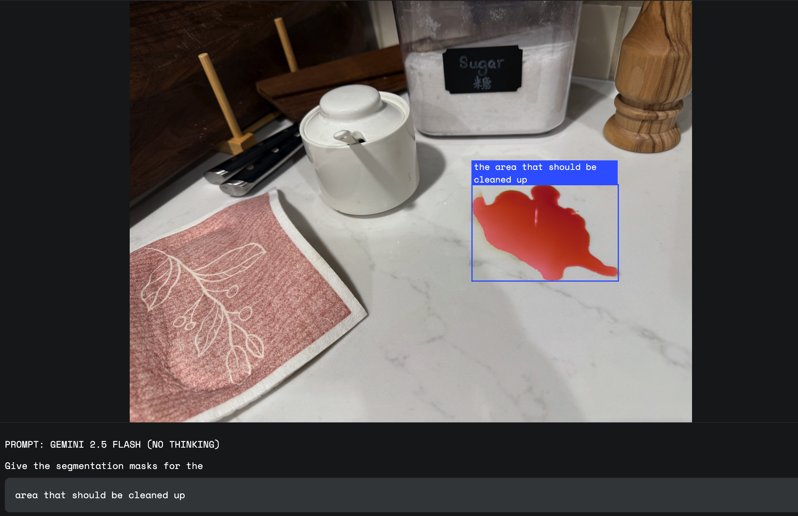
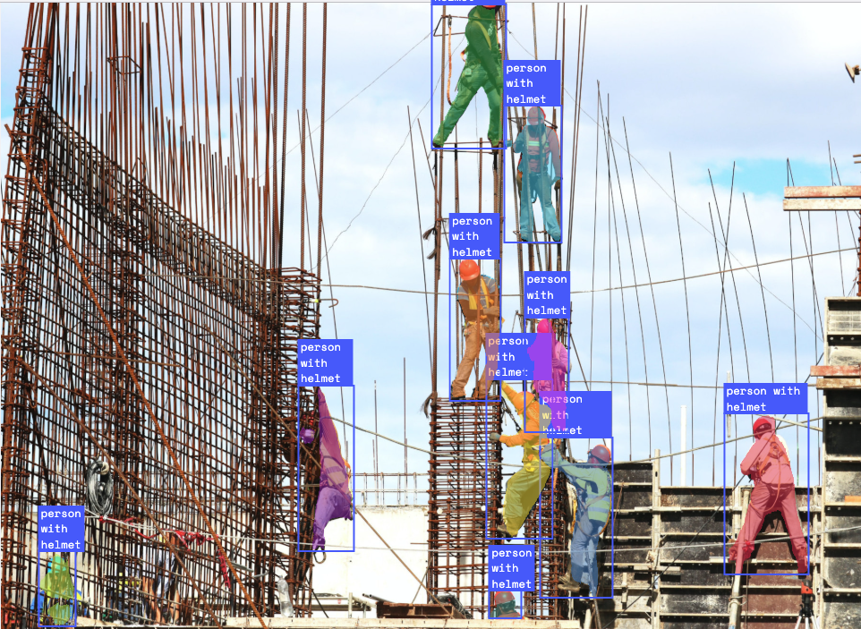
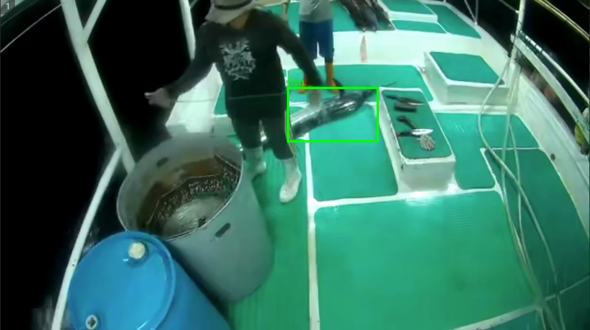

# Semi‑Automated Object Detection Model Training Pipeline — Using Conversational Image Segmentation with Gemini 2.5 Flash



Google’s brand‑new **Conversational Image Segmentation (CIS)** API in *Gemini 2.5 Flash* lets you describe what you want in plain English— _“Detect the spill on the desk that needs to be cleaned”_, or _“Find any construction worker **without a helmet**”_—and immediately receive bounding boxes (or masks).  

This repository shows how to turn those detections into high‑quality training data **and** how to feed that data back into an open‑source detector (YOLO) for *free, low‑latency inference*.

> For well‑defined detection tasks, this semi‑automated workflow offers a **cost‑effective** and **time‑saving** path from raw images to a production‑ready model.

---

## 🚀 What Problem Does This Solve?

| Challenge of inference with Gemini           | Our Solution |
|----------------------------------------------|--------------|
| **💸 Cost** – every inference call is billed | Use Gemini to draft annotations, then train YOLO locally |
| **⏱️ Latency** – cloud round‑trip time       | After fine‑tuning YOLO the model runs on‑device in milliseconds |
| **🎯 Accuracy** – API misses edge‑cases      | Human‑in‑the‑loop review in Label Studio fixes bad boxes |


---

## 🖼️ Example Queries

<table>
<tr>
<td width="50%"><strong>Complex Scene – “Find the spill on the desk”</strong><br/><br/></td>
<td width="50%"><strong>Safety Compliance – “Detect workers <i>with/without</i> helmets”</strong><br/><br/></td>
</tr>
</table>

---

## 📚 Repository Contents

| Script / Folder | Purpose |
|-----------------|---------|
| `gemini.py` | Call the Gemini 2.5 CIS API, handle auth & retries |
| `converter.py` | Convert Gemini response → Label Studio `rectanglelabels` JSON |
| `check_gemini_api.py` | Quick sanity‑check of the API & your key |
| `run.ipynb` | Interactive notebook: from images → Gemini → Label Studio JSON |
| `output_results/` | Raw responses from the API (one *.json* per image) |
| `test_image/` | Sample images to try out the pipeline |

---

## 🔧 Requirements

* **Python**  
* A **Gemini API key** – get one from the [AI Studio console](https://aistudio.google.com/)  
* (Optional) [Label Studio](https://labelstud.io/) for annotation review

Install the minimal dependencies:

```bash
pip install --upgrade google-genai pillow
```

Set your key (either variable name works):

```bash
export GOOGLE_API_KEY="AIza...your_key..."
# or
export GEMINI_API_KEY="AIza...your_key..."
```

### 🐟 Demo: Batch Fish Detector (Gemini 2.5 Flash)

This repo started as a tiny proof‑of‑concept for spotting fish in video frames with Gemini 2.5’s Conversational Image Segmentation.  
If you want a *minimal* example before diving into the full semi‑automated pipeline, try this:

> **Prompt tip** – be explicit about **what** to detect and **what** to return.  
> Example prompt  
> ```text
> Detect all fish in the image and return a JSON list with
> "label" and "box_2d" = [ymin, xmin, ymax, xmax] on a 0‑1000 scale.
> ```

Run:

```bash
python gemini.py           # or: jupyter notebook run.ipynb
```

You will get, for each input frame:

* an annotated PNG with green bounding boxes in `output_results/`
* a matching JSON file containing the coordinates

> **Billing note:** each CIS request is billed per call (free‑trial credits apply).  
> Requesting bounding boxes—as we do here—is cheaper than full‑resolution masks.

---

## ⚡ Quick Start

```bash
# 1. Put images into the input folder
mkdir -p test_image
cp ~/my_frames/*.jpg test_image/

# 2. Run the detector (outputs JSON + annotated PNGs)
python gemini.py

# 3. Convert to Label Studio tasks
python converter.py  # creates tasks.json & import_to_ls_gcs.json

# 4. In Label Studio
#    • Import tasks.json (local paths) or import_to_ls_gcs.json (GCS URLs)
#    • Review / tweak boxes where necessary

# 5. Export corrected dataset and train your favourite YOLO flavour 🚀
```

---

## 🏗️ Semi‑Automated Training Pipeline

1. **API Draft Annotations** – Gemini detects objects of interest.  
2. **Save to Cloud** – Store frames + detections on Google Cloud Storage.  
3. **Annotation Review** – Load tasks into Label Studio, fix mistakes.  
4. **Model Training** – Fine‑tune YOLO (or any detector) on the curated dataset.  
5. **On‑Device Inference** – Deploy the trained model for zero‑cost, low‑latency predictions.



## 🔗 References

* [Conversational Image Segmentation with Gemini 2.5 – Official blog](https://developers.googleblog.com/en/conversational-image-segmentation-gemini-2-5/)
* [Label Studio Documentation](https://labelstud.io/)
* [YOLO11 Documentation](https://docs.ultralytics.com/models/yolo11/)